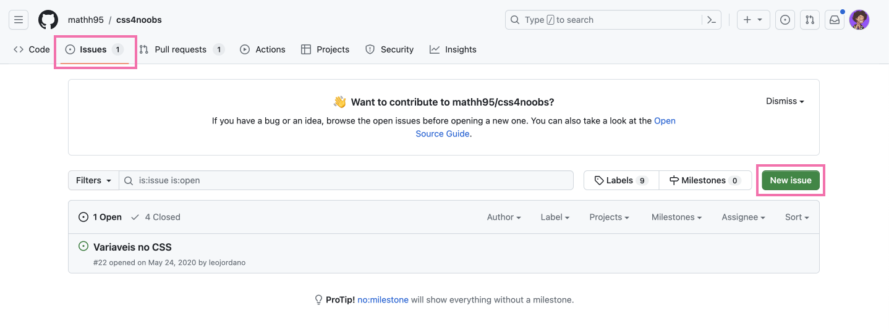

## Como contribuir?

Como iremos inicialmente usar o Github para hospedar o curso, gostariamos de pedir para qualquer dúvida referente à alguma aula ou melhorias que você crie uma **Issue** no nosso repositório, para que assim consigamos resolver e manter uma padronização de perguntas/respostas dentro do nosso projeto.

Para criar uma issue, no [repositório do GitHub do css4noobs](https://github.com/he4rt/css4noobs/issues) clique na aba Issues e no botão **New Issue**.

 

**Próxima página &rarr; [O que é CSS?](./3-o-que-e-css.md)**

