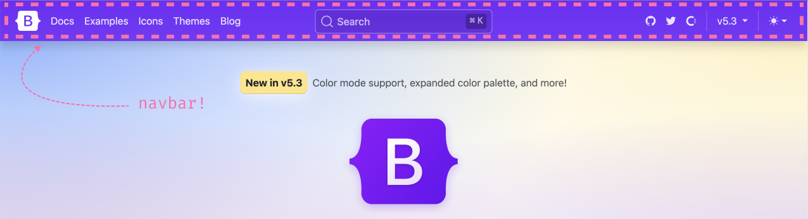
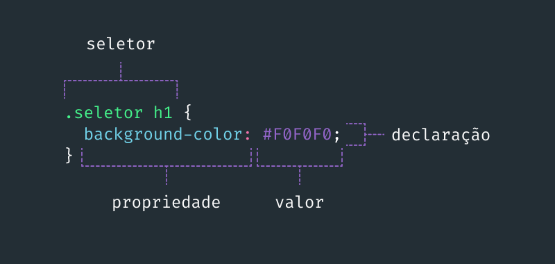

# Como o CSS funciona?  

No CSS referenciamos as tags ou atributos HTML através de **seletores** e usando **propriedades** e **valores** conseguimos alterar a aparência e usabilidade de um site. Um bloco de CSS pode conter uma ou mais **declarações** que alteram uma característica específica, como o background-color, que define qual a cor do plano de fundo do elemento HTML referenciado pelo seletor.

<br />


**Se fossemos estilizar uma barra de navegação de um site, sabe aquela que fica no topo da maioria dos sites e contém links para todas suas seções?**




<br />

Primeiro, escrevemos o HTML demarcando o conteúdo. Barras de navegação geralmente tem um logo e uma lista de links:


```html
<nav>
    
    <ul>
        <li><a href="#">item 1</a></li>
        <li><a href="#">item 2</a></li>
        <li><a href="#">item 3</a></li>
    </ul>
</nav>
```

<br />

Para estilizarmos cada elemento dessa barra de navegação, podemos utilizar [seletores CSS](../Modulo-Basico//seletores.md).

```css
nav {
  /* CSS de exemplo */
  display: flex;
  align-items: center;
  justify-content: space-evenly;
}

img {
  /* ---- */
}

ul {
  /* ---- */
}

li {
  /* ---- */
}

a {
  /* ---- */
}
```

<br />  

## Mas o que representam essas marcações?

- __seletor__: Elemento ou atributo do HTML que será estilizado (por exemplo, uma div, um parágrafo, uma section). Para saber mais sobre os seletores, acesse [a nossa documentação sobre seletores &boxbox;](../Modulo-Basico/seletores.md).

- __propriedade__: A característica a ser alterada - como, por exemplo, cor do texto, cor de fundo do elemento, seu tamanho e espaçamento.

- __valor__: As opções de customização dessa característica, como, por exemplo, definir uma cor `red` pra propriedade `color`.





<details>
  <summary><strong>🔎&nbsp;Código Fonte</strong></summary>

```css

.seletor h1 {
  background-color: tomato;
}

```

</details>

<br/>

<div align="center">

**Próxima página &rarr; [Adicionando CSS no HTML](./5-adicionando-css-no-html.md)**

</div>