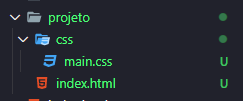

# Adicionando CSS nas páginas HTML

Podemos adicionar CSS em nossas páginas HTML de três formas, usando a tag style, usando o atributo style ou usando a tag link, com essa última sendo a mais recomendada nos dias atuais.

## Tag `<style>`

Podemos usar a tag `<style>` para estilizar nossas páginas HTML.

Para trabalharmos com ela, basta adicionar a tag dentro da `<head>` da nosso documento HTML.

```html
<html>
  <head>
  <!-- Adicionamos a tag style aqui para podermos estilizar nossa página -->
    <style>
      .box-red {
        background-color: red;
        width: 100px;
        height: 100px;
      }
    </style>
  </head>
  <body>
    <div class="box-red">
     <p> Box </p>
    </div>
  </body>
</html>
```

## Atributo style - Style Inline

O atributo _style_, também conhecido como style inline, é um atributo que usamos dentro das nossas tags para estilizá-las.

Para trabalharmos com ela, basta adicionarmos o atributo style dentro da nossa tag do documento HTML.

```html
<html>
  <head>
    <title> CSS Inline </title>
  </head>
  <body>
    <div class="box-red">
    <!-- Adicionamos o atributo style aqui para podermos estilizar nossa tag -->
     <p style="color:red;"> Box </p>
    </div>
  </body>
</html>
```

## Style externo - Link

Essa última, e mais recomendada forma de trabalharmos com CSS consiste em usar a tag `<link>` para fazermos uma ancoragem entre nosso documento HTML e nosso arquivo .css.

Suponhamos que nossa estrutura de pastas está da seguinte forma:


O que é comum fazer é criarmos uma pasta onde criaremos nossos arquivos.css e dentro dela criar os arquivos em si, deixando a estrutura de pastas mais ou menos dessa forma:



E após isso, escrevemos nossas regras de CSS dentro do arquivo `main.css`.

E como fazemos pra que nosso arquivo HTML entenda essas regras? Com a tag `<link>`.

```html
<html>
  <head>
   <!-- Aqui adicionamos a tag link, com referência para nosso arquivo CSS -->
   <link rel="stylesheet" href="css/main.css">
  </head>
  <body>
    <div class="box-red">
     <p style="color:red;"> Box </p>
    </div>
  </body>
</html>
```

Onde:
- __rel__ = a relação que esse link tem com nosso arquivo (nesse caso é um stylesheet).
- __href__ = a referência de onde esse arquivo está (no nosso caso, dentro da pasta _css_ com o nome _main.css_).