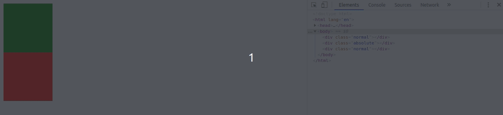
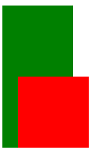

# Position - relative, absolute, fixed,sticky, static

Vamos desvendar e aprender todas as propriedades do position que é muito importante para o posicionamento dos elementos.

## Position static

Dificilmente ou nunca você vera alguem utilizando o ```position: static``` pois ele é o valor default de todos os nossos elementos. 

É bom conhecer ```static``` pois agora você sabe que qualquer elemento tem como padrão ```position: static```.

## Position absolute

Quando setamos essa propriedade em nosso documento, retiramos o nosso elemento do fluxo normal de nosso documento, nenhum espaço é criado no layout da pagina e conseguimos manipular o elemento com ```top```,```left```, ```right```, ```bottom```, vamos mostrar um exemplo do que ocorre:

No HTML:
```html
    <div class="normal"></div>
    <div class="absolute"></div>
    <div class="normal"></div>
```

No CSS:
```css
    .normal{
        width: 100px;
        height: 100px;
        background: green;
    }

    .absolute {
        width: 100px;
        height: 100px;
        background: red;
    }
```

Sem setar a propriedade position, temos esse resultado na nossa tela:

<p align="center">
  
</p>

Agora iremos setar a propriedade position para absolute:

No CSS:
```css
    .normal{
        width: 100px;
        height: 100px;
        background: green;
    }

    .absolute {  
        /* estamos pegando a div com classe absolute */
        position: absolute;
        width: 100px;
        height: 100px;
        background: red;
    }
```

O resultado que temos é:

<p align="center">
  
</p>

O que ocorreu foi que devido o position absolute não criar espaço somente ocupar o conteudo que o elemento tem, a nossa terceira div foi para cima já que não encontrou nenhum espaço e por conta disso ficou abaixo da nossa div com a position absolute, mas conforme você consegue ver no GIF acima a nossa terceira div esta lá.

Outro comportamento que o position absolute possui é que se você manipular o elemento com ```top```,```left```, ```right```, ```bottom``` ele sempre vai estar naquela posição por que não acompanha o fluxo do nosso documento, vamos ver com um exemplo:


No CSS:
```css
    .normal{
        width: 100px;
        height: 100px;
        background: green;
    }

    .absolute {  
        position: absolute;
        left: 30px;
        width: 100px;
        height: 100px;
        background: red;
    }
```

Temos o resultado:

<p align="center">
  
</p>