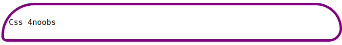
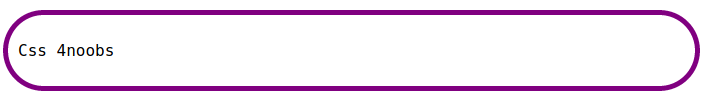

# Border Radius - O que diabos é isso?

A propriedade `border-radius` permite adicionar bordas arredondadas no seu elemento.

O valores usados para definir as bordas podem ser em `px` ou `%`, mas exemplos abaixo terá somente valores em px.

Essa propriedade pode ter de um a quatro valores. Aqui estão as regras:

### Quatro valores:

O primeiro valor se aplica ao canto superior esquerdo, o segundo valor se aplica ao canto superior direito, o terceiro valor se aplica ao canto inferior direito e o quarto valor se aplica ao canto inferior esquerdo.

```css
border-radius: 125px 100px 50px 20px;
```

<br>

---

### Três valores:

O primeiro valor se aplica ao canto superior esquerdo, o segundo valor se aplica aos cantos superior direito e inferior esquerdo e o terceiro valor se aplica ao canto inferior direito.

```css
border-radius: 45px 50px 75px;
```

<br>

---

### Dois valores:

O primeiro valor se aplica aos cantos superior esquerdo e inferior direito, e o segundo valor se aplica aos cantos superior direito e inferior esquerdo.

```css
border-radius: 15px 50px;
```

<br>

---

### Um valor:

O valor se aplica a todos os quatro cantos, que são arredondados igualmente:

```css
border-radius: 15px;
```

<br>
