# Border - O que diabos é isso?

A propriedade `border` permite adicionar uma borda no seu elemento e definir um estilo (`border-style`), largura (`border-width`) e cor (`border-color`).

Assim como a propriedade `margin` e `padding` ela também irá compor o seu [_box-model_](./box-model.md).

Você pode definir a propriedade em uma única declaração, as chamadas _shorthands_, por exemplo:

```css
border: 5px solid #c6c6c6;
```

Você pode ler essa mesma linha acima sendo:

```css
border: [border-width] [border-style] [border-color];
```

## Largura da borda (border-width)

Essa propriedade permite que você defina qual a largura será aplicada para a borda, podendo também especificar um tamanho para cada lado.

Você pode definir a largura da borda utilizando alguma unidade como px, pt, cm, em, % e outras, ou pode também utilizar valores pre-definidos como _thin_, _medium_ e _thick_

```css
border-style: solid;
border-width: 5px;
```

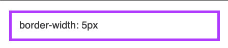<br>

```css
border-style: solid;
border-width: medium;
```

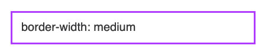<br>

```css
border-style: dotted;
border-width: 5px;
```

<br>

## Estilo da borda (border-style)

Essa propriedade define qual estilo a sua borda terá, podendo aplicar um estilo único para todo o elemento ou definir até 4 tipos diferentes, sendo um para cada lado do elemento (superior, inferior, esquerda e direita).

Você pode aplicar os seguintes estilos:

`dotted` - A borda será preenchida com pontos<br>
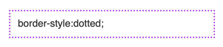<br>
`dashed` - A borda será preenchida com traços<br>
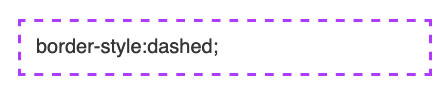<br>
`solid` - A borda possuirá um preenchimento sólido<br>
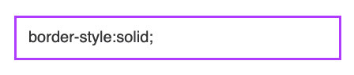<br>
`double` - A borda será composta por dois traços sólidos<br>
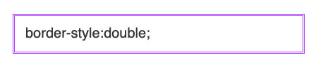<br>
`groove` - Aplica um padrão de sombra com aparência 3D<br>
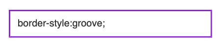<br>
`ridge` - Aplica um padrão de sombra elevada com aparência 3D<br>
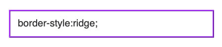<br>
`inset` - Aplica um padrão de sombra em baixo relevo com efeito 3D<br>
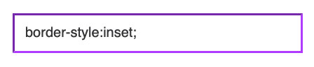<br>
`outset` - Aplica um padrnao de sombra em alto relevo com efeito 3D<br>
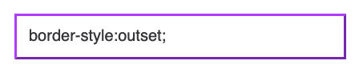<br>
`none` - Não exibe borda no elemento<br>
`hidden` - Oculta a borda do elemento<br>

Você também pode aplicar um estilo individual para cada lado do seu elemento, como no exemplo a baixo:

```css
border-style: double dotted solid dashed;
```

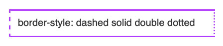<br>

## Cor da borda (border-color)

Essa propriedade permite que você defina qual cor será aplicada na borda. Você pode setar as cores como:

**nome** - Pode especificar a cor pelo nome, como 'red' ou 'black'<br>

**HEX** - Define a cor através de um valor hexadecimal como #FFFFFF ou ##af47ff<br>

**RGB** - Define a cor através de um valor da curva rgb, como _rgb(255,255,255)_<br>

**HSL** - Define a cor através de um valor definido por hue, saturação e luminosidade como _hsl(0, 100%, 50%)_<br>

**transparent** - Não define uma cor, mas ainda irá ocupar o espaço definido pelo `border-width`<br>

**_OBS_**: Caso não seja definido nenhuma cor para a borda, ela aplicará a cor do elemento.

```css
border-color: orange;
```

<br>

```css
border-color: rgb(235, 52, 85);
```

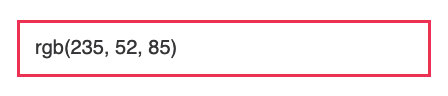<br>

```css
border-color: #663681;
```

<br>

Todas essas declarações `border-width`, `border-color` ou `border-style` também podem ser feitas passando especificamente em qual lado você quer aplicar. Essa solução se aplica quando você não pretende aplicar a borda em todo o elemento.

```css
border-top-color: #663681;
border-top-style: dashed;
border-top-width: 2px;

border-bottom-color: #b32d88;
border-bottom-style: dotted;
border-bottom-width: thick;

border-left-color: #ffa436;
border-left-style: solid;

border-right-color: #28cef7;
border-right-style: double;
border-right-width: 10px;
```

<br>
