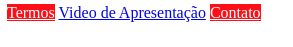
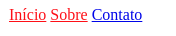

# Seletores de Atributos

Nos já vimos como usarmos o seletor de atributo "igual", onde selecionamos os elementos que contém aquele
atributo com aquele exato valor, por exemplo:

```css
/* Estamos pegando todos os elementos que tem o atributo type com valor "button" */
[type='button'] {
  width: 100px;
  height: 100px;
  background-color: red;
}
```

Podemos aperfeiçoar ainda mais nossos seletores, utilizando algumas expressões a mais.

## *

Para selecionar elementos que o atributo contenha algum valor específico, não importa em qual
posição este valor esteja no atributo.

Neste exemplo, imagine que queremos aplicar vermelho no texto de todos os links que contenham `login`
no atributo `href`:

```html
<a href="/admin/login.php">Login Admin</a>
<a href="/support/login.php">Login Suporte</a>
<a href="/support/register.php">Cadastro Suporte</a>
```

```css
a[href*="login"] {
  color: red;
}
```

O resultado seria este:


## ^

Para selecionar elementos que o atributo comece com aquele valor.

Neste exemplo, imagine que queremos aplicar amarelo em todos os links que comecem com `https`:

```html
<a href="https://google.com">Google</a>
<a href="http://mywebsite.com">My WebSite</a>
<a href="https://twitter.com">Twitter</a>
```

```css
a[href^="https"] {
  color: yellow;
}
```

O resultado seria este:


## $

Para selecionar elementos que o atributo termine com aquele valor.

Neste exemplo, imagine que queremos fazer algumas alterações no fundo e na cor dos links que terminam com `.pdf`:

```html
<a href="/termos.pdf">Termos</a>
<a href="/apresentacao.mp4">Video de Apresentação</a>
<a href="/contato.pdf">Contato</a>
```

```css
a[href$=".pdf"] {
  background-color: red;
  color: #FFF;
}
```

O resultado seria este:



## ~

Para selecionar os elementos que o atributo tenha aquele valor separado de outros valores por espaço.

Por exemplo, imagine que alterar a cor de todos os links que tenham o valor `tag` no atributo `rel`, porém este atributo
pode aceitar mais valores separados por espaço:

```html
<a href="#home" rel="tag nofollow">Início</a>
<a href="#about" rel="nofollow tag">Sobre</a>
<a href="/contato.html" rel="nofollow">Contato</a>
```

```css
a[rel~="tag"] {
  color: red;
}
```

O resultado seria este:



## |

Para selecionar os elementos que o atributo tenha aquele valor separado de outros valores por hífen e que o atributo comece
 com aquele valor declarado.

Por exemplo, imagine que alterar a cor de todos os links que tenham o valor `pt` declarado no começo do atributo `lang`, porém este atributo
pode aceitar mais valores separados por hífen:

```html
<a href="/contato.html" lang="pt-BR">Contato</a>
<a href="/contact.html" lang="en-US">Contact</a>
<a href="/contacto.html" lang="es-ES">Contacto</a>
```

```css
a[lang|="pt"] {
  color: green;
}
```

O resultado seria este:


