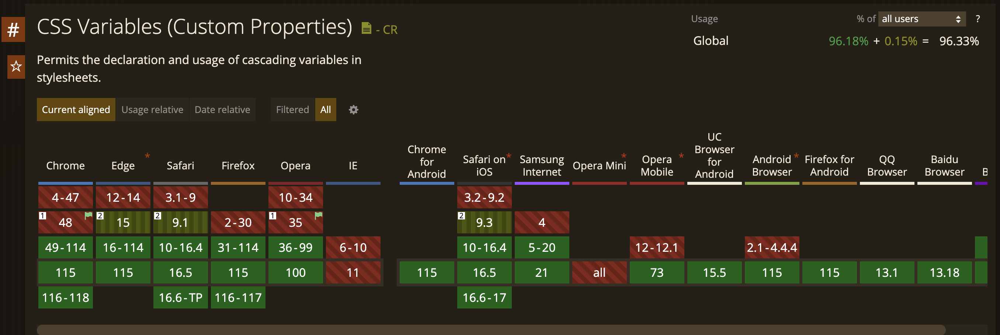

# Variáveis do CSS

## Índice

1. [O que é](#o_que_é)
2. [Como usar?](#como_usar)
3. [Já podemos usar em produção?](#usar_em_prod)

<br/>

## <a id="o_que_e"></a>O que é

Variáveis CSS são entidades definidas por nós desenvolvedores, contendo valores que irão ser utilizados em todo o nosso projeto. Utilizamos o `var(<variavel>)` para indicar que estamos chamando uma variável do CSS. Essas variáveis são "vivas", o que significa que ao declará-las no seu código, elas podem ser alteradas no navegador, seja por media queries ou por Javascript.

Elas foram criadas na especificação [CSS Custom Properties Lvl1](https://drafts.csswg.org/css-variables/#using-variables) pra que a gente possa padronizar as características de design do projeto, como cores, espaçamentos e afins.

Um uso comum é declarar as variáveis dentro do `:root`, pois na hierarquia de seletores, o escopo dele é mais abrangente do que o do `<html>`, sendo o equivalente a declarar variáveis CSS globalmente, mas você pode declarar variáveis dentro de qualquer seletor CSS, ou `@media`.

&nbsp;

> 💡 Pra saber mais sobre `:root` leia [a documentação sobre pseudo-classes](./pseudo-classes.md). 

&nbsp;

Para declarar variáveis CSS basta inicializá-las com dois traços `--`.
```css
:root {
  --text-primary: red;
}
```

Pra utilizar a variável, basta usar a função `var()`.
```css
section {
  background-color: var(--text-primary);
}
```

É possível também declarar valores padrão pra variáveis, assim caso a variável não exista, ele tem um _default_.
```css
.element {
  width: var(--size, 300px);
  /* Na ausência de --size, o valor será 300px */
}
```

<br/>

------

<br/>


## <a id="como_usar"></a>Como usar?

**Usar variáveis CSS como parâmetros**

Você pode criar classes CSS com variáveis e usá-las passando valores diferentes. Por exemplo, podemos criar uma classe pra ajustar imagens e usar a mesma classe com diferentes tamanhos.

```css
.square-image {
  display: block;
  max-width: 100%;
  width: var(--size, 100px);
  height: var(--size, 100px);
  object-fit: cover;
}
```

E usamos a classe da seguinte forma:

```html
<!-- Nessa imagem, width e height são 200px -->

<!-- Nessa imagem, width e height são 150px -->

<!-- Nessa imagem, width e height são 150px, o valor padrão -->

```

&nbsp;

> 💡 Se você tiver familiaridade com Javascript, pode pensar nessa forma de aplicar variáveis CSS como criar funções de Javascript. O `var(--size, 100px)` pode ser lido como `function size(size='100px') {}`&nbsp; e o `style="--size: 200px"` no HTML pode ser lido como `size("200px")`.

&nbsp;

**Fazer mudanças via Media Query**

Uma coisa muito comum é usar Media Queries pra mudar o layout do site pra um formato de coluna quando a visualização for de telefone celular (mobile). Uma forma legal de controlar esse fluxo de fileira pra é usando flexbox.

```css
.main-section {
  display: flex;
}

@media (max-width: 420px) {
  .main-section {
    flex-direction: column;
  }
}
```

&nbsp;

> 💡 Leia mais sobre flexbox [nessa página aqui!](flexbox.md)

&nbsp;

Com variáveis CSS, podemos ser muito mais breves:

```css
/* Declaramos flex-direction com a variável --dir e o valor padrão de row */
.main-section {
  display: flex;
  flex-direction: var(--dir, row);
}

/* Na media query, basta atualizar o valor da variável --dir dentro do escopo da classe */

@media (max-width: 420px) {
  .main-section {
    --dir: column;
  }
}
```

Isso acontece pois classes CSS criam um escopo de atuação para as variáveis. Note no caso do `:root`, na hierarquia HTML, o root tem o maior escopo (área de abrangência) de todos:

```html
<!-- :root -->
  <html class="color">
    <body class="color">
      <main class="color">
        <h2 class="color"></h2>
        <div class="color"></div>
      </main>
    </body>
  </html>
<!-- :root  / -->

```
&nbsp;

Então se a gente fizer a seguinte declaração no CSS:

```css
:root {
  --color: red;
}

main {
  --color: green;
}

div {
  --color: purple;
}

.color {
  color: var(--color, black);
}

```

&nbsp;

O resultado vai ser:
```html
<!-- :root -->
  <html class="color"> <!-- A cor vai ser red (root) -->
    <body class="color"> <!-- A cor vai ser red (root) -->
      <main class="color"> <!-- A cor vai ser green (main) -->
        <h2 class="color"></h2> <!-- A cor vai ser green (main) -->
        <div class="color"></div> <!-- A cor vai ser purple (div) -->
      </main>
    </body>
  </html>
<!-- :root  / -->

```

Percebe que usamos a mesma classe, mas conseguimos ter diferentes resultados apenas redefinindo as variáveis? Dessa forma conseguimos um CSS bem mais limpo e consistente.

<br/>

------

<br/>


## <a id="usar_em_prod"></a>Já podemos utilizar em produção?
Variáveis CSS já tem > 96% de cobertura nos navegadores mais populares, além disso tem _polyfills_ (ferramentas que substituem a funcionalidade onde ela não tem suporte) muito bem consolidados na ausência do suporte.

<figure>
  
  <figcaption>Print do site <a href='https://caniuse.com/css-variables' target='_blank'>Caniuse</a> no suporte das variáveis CSS nos navegadores mais populares</figcaption>
</figure>

